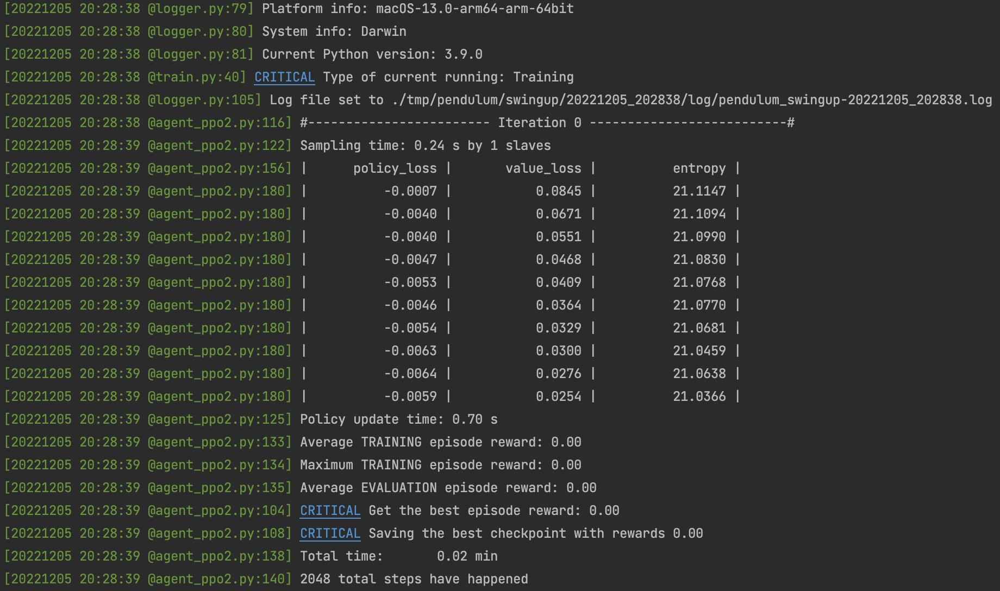
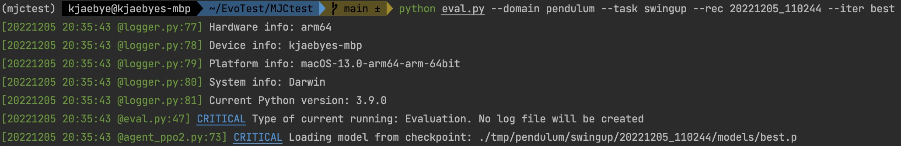
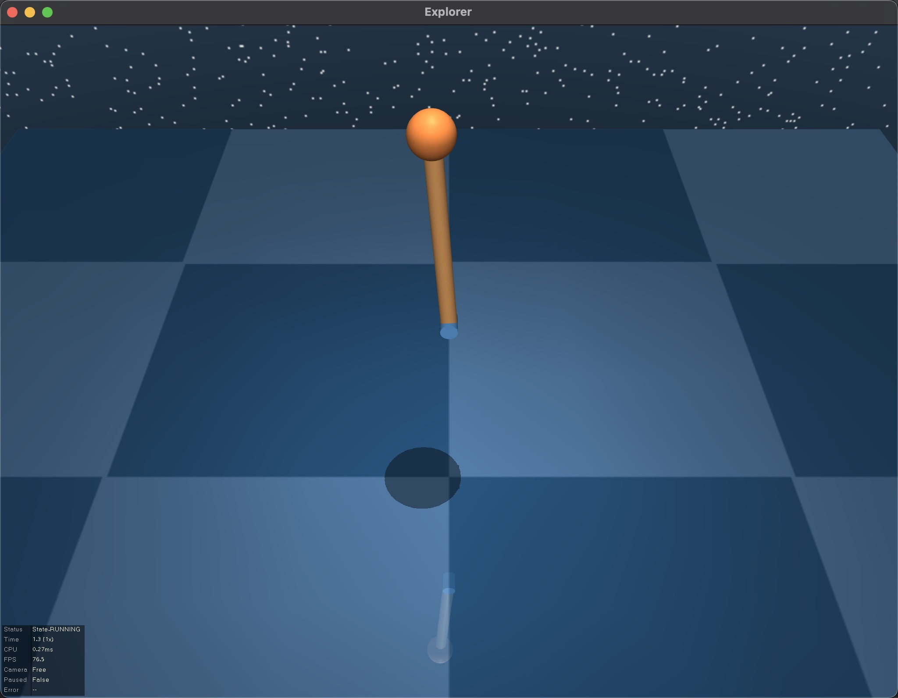

# Introduction
This repo is for MuJoCo learning and PPO algorithm testing.

### Brief description:
- RL algorithm kernal is wrapped in `/lib`; customized environment defined in `/structural_control`.
- PPO2 algorithm is wrapped in `/lib/agents/agent_ppo2.py`, containing networks definition and parameters updating.
- RL sampling part is wrapped in `/lib/agents/agent.py`, providing a multiprocessing method to sample data from MuJoCo.
- Mujoco dm_control environment is wrapped in `/lib/envs/mujoco_env.py`. To create a customized environment, inheriting
and editing class `MujocoEnv`, `MujocoPhysics`, `MujocoTask`.

### Some features are realised:
- Using formatted logger makes better visualization and data monitoring.
- Using .yml config file to manage hyperparameters.
- Using argparse module to manage frequently changed variables.
- Using tensorboard module for supervision.
- Providing a well organized `lib` module for PPO reinforcement learning realised by the newest version of pytorch 
(until 01.Dec.2022).
- Providing a native `dm_control.viewer` method for visualization.

----
# Folder Structure

`/assets` directory includes all robots models in .urdf, .xml, .mjb, .txt formats.

`/config` directory include settings .yml files for training, located at **/config/cfg**. Besides, **get_args.py** 
parses commands from terminal, **config.py** loads .yml files.

`/utils` includes formatted logger, and other useful modules but less related to RL core algorithm.

`/lib` includes all RL related core modules.

`/tmp` is the logging file directory, including log file, saved models, and `/tb` directory.

`/structural_control` includes the customized agent and env that inherits from `lib`.

> Please note that: results are generated in **/tmp** in default, classified by domain and task.
----------------------

# Usage
Training:
```commandline
python train.py --domain pendulum --task swingup --num_threads 10
```

Evaluation and visualization:
```commandline
python eval.py --domain pendulum --task swingup --rec 20221205_110244 --iter best
```


----------------------
# Environment

Deepmind MuJoCo python bindings `dm_control` is used.

> Important: OpenAI gym, mujoco-py are not used in this work because mujoco-py was no longer maintained
> since MuJoCo was acquired by deepmind...Pity...

- python==3.9
- mujoco==2.3.0
- dm_control==1.0.8
- glfw==2.5.5
- numpy==1.23.3
- tensorboard==2.11.0
- protobuf==3.20.3
### Macbook Pro with M1
- torch==1.12.1
- torchvision==0.13.1
- torch-geometric==2.1.0
- torch-scatter==2.0.9
- torch-sparse==0.6.15
- torch-cluster==1.6.0
- torch-spline-conv==1.2.1
### PC with x_86 architecture
- torch==1.12.0_cu116
- torchvision==0.13.0_cu116
- torch-cluster==1.6.0
- torch-geometric==2.1.0
- torch-scatter==2.0.9
- torch-sparse==0.6.14
- torch-spline-conv==1.2.1